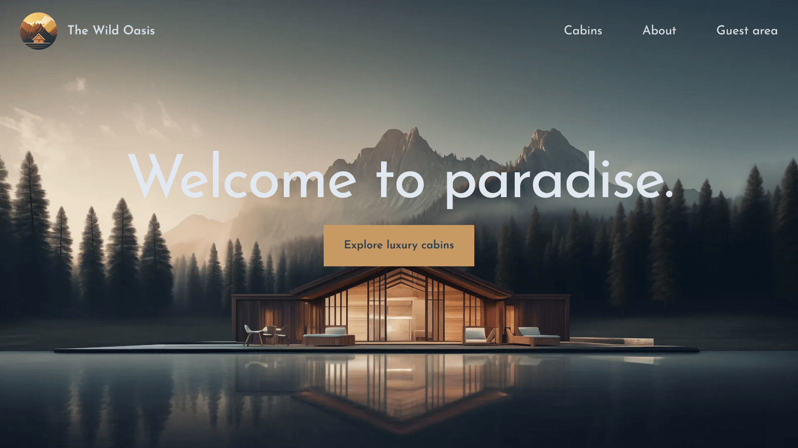

<div align="center">

  

  <h1>The Wild Oasis - Booking</h1>

  <h3>
    <a href="https://the-wild-oasis-booking-alamin.vercel.app">
      <strong>Live Site</strong>
    </a>
  </h3>

  <div align="center">
    <a href="https://the-wild-oasis-booking-alamin.vercel.app">View website</a>
    •
    <a href="https://github.com/CodePapa360/The-Wild-Oasis-Booking/issues">Report Bug</a>
    •
    <a href="https://github.com/CodePapa360/The-Wild-Oasis-Booking/pulls">Request Feature</a>
  </div>

  <hr>

</div>

<!-- Badges -->
<div align="center">

[](https://www.linkedin.com/in/CodePapa360)
[](https://x.com/CodePapa360)


</div>

<!-- Brief -->
<p align="center">
Welcome to <b>The Wild Oasis</b>! This is the customer version of the <a href="https://github.com/CodePapa360/The-Wild-Oasis">hotel management</a> web app, where users can view and book cabins based on availability, manage their bookings, and update their profiles. This project was a great learning experience for me as I explored Next.js, Auth.js (NextAuth), and many other advanced techniques.
</p>

<!-- Screenshot -->
<a align="center" href="https://the-wild-oasis-booking-alamin.vercel.app">



</a>

## Live Site

Check out the live app here: [The Wild Oasis - Booking](https://the-wild-oasis-booking-alamin.vercel.app/)

## Admin Version

I also built an **admin version** of this app for hotel employees to manage cabins, bookings, and guests. The repository is [here](https://github.com/CodePapa360/The-Wild-Oasis), and the live site is [here](https://the-wild-oasis-alamin.vercel.app).

## Features

- View all available cabins with descriptions and images.
- Book a cabin based on available dates and select the number of guests.
- Sign in with Google to manage bookings.
- View your booked cabins, edit them, or cancel if needed.
- Update your profile information.
- Fully responsive on all devices (I made sure to make it mobile-friendly!).

## Technologies Used

- **Next.js** (App Router)
- **Tailwind CSS** for styling
- **Supabase** for the database (shared with the admin app)
- **NextAuth.js** for authentication (Google sign-in)
- **Date-fns** for date handling

## What I Learned

This project deepened my knowledge of Next.js (especially the App Router) and introduced me to using libraries like NextAuth.js. I learned to build a fully functional booking system, integrate user authentication, and ensure the app is responsive on all devices.

## Setup Instructions

To run this project locally:

1. Clone the repo:
   ```bash
   git clone https://github.com/CodePapa360/The-Wild-Oasis-Booking.git
   ```
2. Install dependencies:
   ```bash
   npm install
   ```
3. Set up environment variables:
   - You’ll need to configure Supabase and NextAuth (Google sign-in). Add your environment variables in a `.env.local` file. Check out the `.env.local.example` for what you need to include.
4. Run the development server:
   ```bash
   npm run dev
   ```
5. Open [http://localhost:3000](http://localhost:3000) to see the app.

### Author

<b>👤 Alamin</b>

- LinkedIn - [@CodePapa360](https://www.linkedin.com/in/codepapa360)
- Twitter - [@CodePapa360](https://www.twitter.com/CodePapa360)
- GitHub - [@CodePapa360](https://github.com/codepapa360)

Feel free to contact me with any questions or feedback!

### Acknowledgments

This app was developed as part of the [Udemy course](https://www.udemy.com/course/the-ultimate-react-course) by **Jonas Schmedtmann**. His teaching style and guidance were instrumental in helping me build this project and learn Next.js at a deeper level. Huge thanks to Jonas for making the learning experience enjoyable and impactful.
